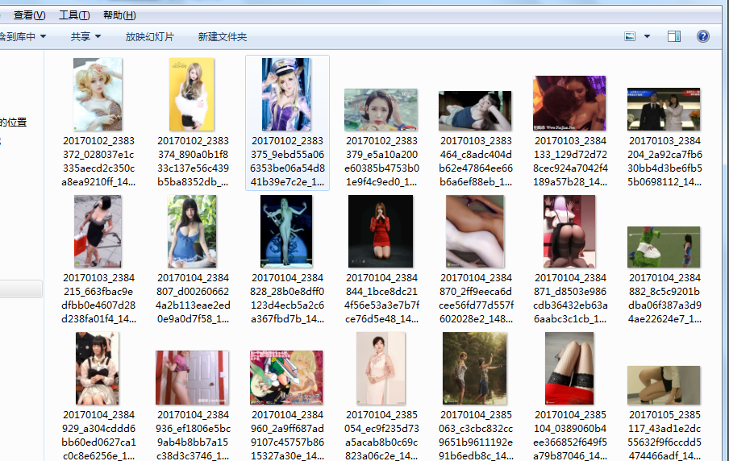

# nodeJs-爬虫
## 开始
   分为两个部分：                 
        1、获取图片地址               
        2、下载图片                      
        3、导入必要的模块，使用cheerio模块，可以使用 npm install cheerio 进行安装
        
>  如果你觉得我做的不错的话，我就厚着脸皮求个 **star** ⭐️ 哈，**star** 是对我最大的鼓励（老脸一红）       
        

## 执行
   切换到项目目录，执行 node app , 然后就静静的等待把，每次下载完一个会有对应的文件名打印出来的。

>最后会出现 下载完毕！，之后就....... 你懂得....                 
  。                                                 
  。           
  。           
  。          
  。               
  。             
  。                 
  。                 
  。               
  。                
  。                     
  。                          
  。                      
  。                        
  。                       
 
